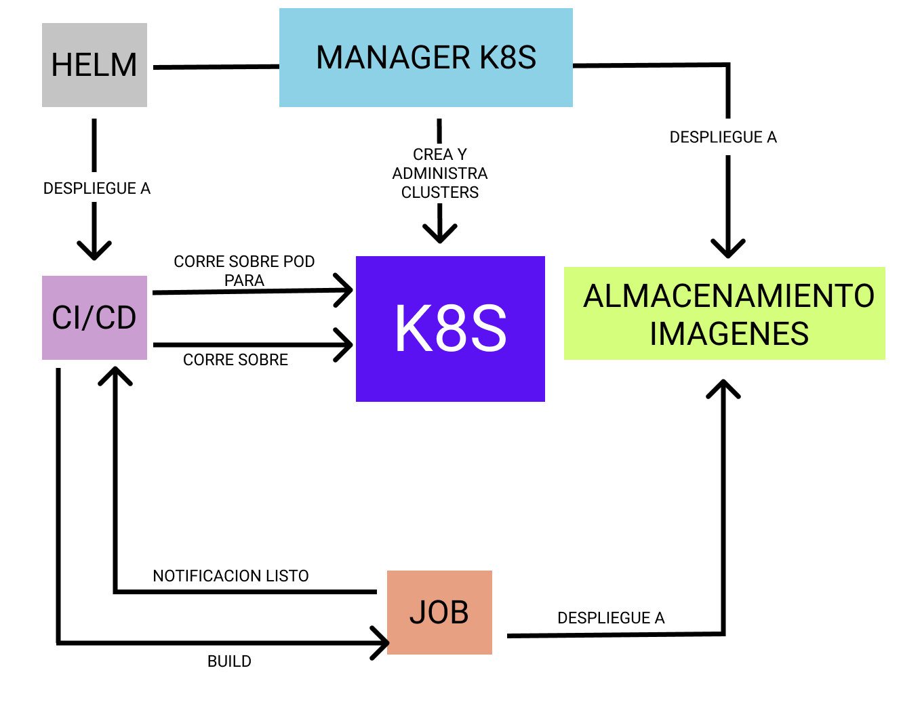
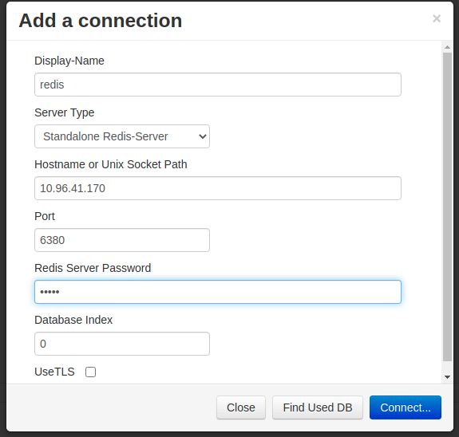
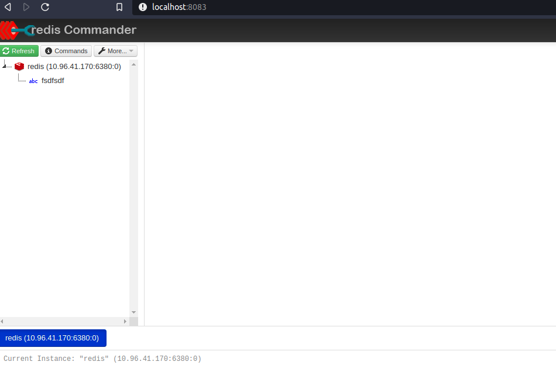

# DESPLIEGUES

La arquitecutra de despligue suele ser una arquitectura de 3 capas, no quiero entrar demasiado en la arquitectura de 3 capas, pero basicamente son 3 capas logicas que representan: 

- una capa de presentacion publica, es accesible desde fuera y es posible enviar informacion afuera
- una capa de logica privada, no es accesible desde fuera pero puede enviar informacion afuera
- una capa de datos, ni es accesible desde fuera ni puede enviar informacion fuera.

A nivel de modelado son un conjunto de subredes publicas, privadas, y de datos.

# Y AHORA QUE?

Ya tenemos nuestra imagen(su nombre PRO: artifact) docker y ahora que? Antes de realizar el despligue se asegura que las imagenes(artifacts) y el codigo(sonarqube, DAST, zap owasp, etc..) esten libres de vulnerabilidades, seguras, chequeos de integridad, etc... Servicios para securizar las imagenes:

- **Harbor.** Conjunto de herramientas que se despliegan en el cluster que securizan las imagens con politicas de acceso, escaneos, y firma de las imagenes, ademas de replicacion, cache del docker hub. https://goharbor.io/
- **Nexus.** Soluciones para auditar y secuirzar las imagenes https://www.sonatype.com/products/repository-oss
- **Jfrog Artifactory.** Si quieres tener un repositorio centralizado de todo, no solo de contenedores. https://jfrog.com/artifactory/
- **Quay.** Servicio de pago para securizar las imagenes
- **Trivy.** Scanner de vulnerabilidades para imagenes https://github.com/aquasecurity/trivy

> NOTA: Todos los servicios de registros de imagenes tienen sus fallos como caidas, degradaciones, incluso siendo de pago.

Ya hemos dado unas pinceladas, seguimos.

## REGISTRO LOCAL

Kind tiene particularidades que ayudan a cargar imagenes docker en un cluster local para utilizarlo desde kubernetes.


## PLUGIN KUBERNETES PARA VISUAL STUDIO CODE
- Kubernetes para VSCode. 
> https://marketplace.visualstudio.com/items?itemName=ms-kubernetes-tools.vscode-kubernetes-tools


# MANIFIESTOS O ARCHIVOS DE CONFIGURACION

Cada archivo de configuracion de los despligues suele tener miles de lineas, si tienes muchas aplicaciones por desplegar, facilmente llegas a los 20k lineas por un despliegue con chorropecientos archivos. 

Han desarrollado bastantes herramientas para facilitar los despligues, las mas usadas son:
  - **helm.** package manager, muy estilo a apt, npm,...
  - **jsonnet.** json que permite variables, funciones, no tiene tipos.. asi que seria lo mismo que helm al final
  - **ytt.** Herramienta que te permite realizar templates con variables, for, if, funciones,... muy estilo sass


## HELM

Es una herramienta que forma parte del ecosistema de kubernetes. Los gurus definen a Helm como un package manager, tambien se utiliza como herramienta de configuracion y te ayuda a ciertos despligues gracias a los templates (similar a ejs, jinja, etc..) y parametrizar las variables en archivos yaml, por ejemplo, variables-base.yaml, variables-produccion.yaml, variables-dev.yaml, y dentro del template se pueden utilizar los tipicos brackets de los templates {{- with .Values.environmentVars }}.

ejemplo:

```
apiVersion: apps/v1
kind: Deployment
metadata:
  name: {{ include "ejemplo.fullname" . }}
    labels:
      {{- include "ejemplo.labels" . | nindent 4 }}
spec:
  selector:
    matchLabels:
      {{- include "ejemplo.selectorLabels" . | nindent 6 }}
  template:
    metadata:
    {{- with .Values.podAnnotations }}
    annotations:
      {{- toYaml . | nindent 8 }}
    {{- end }}
  labels:
    {{- include "ejemplo.selectorLabels" . | nindent 8 }}
  spec:
    containers:
      - name: {{ .Chart.Name }}
        image: "{{ .Values.image.repository }}:{{ .Values.image.tag |
  default .Chart.AppVersion }}"
    {{- with .Values.environmentVars }}
      env:
        {{- toYaml . | nindent 12 }}
    {{- end }}
```


values.yaml

```
#variables
image:
  repository: gitopsbook/ejemplo
  tag: "v0.2"
nameOverride: "ejemplo"
fullnameOverride: "ejemplo"
podAnnotations: {}
environmentVars: [
  {
    name: "DEBUG",
    value: "true"
  }
]
```
```
kubectl create namespace valores && \
helm template . --values values.yaml | kubectl apply -f- --namespace valores
```
Helm tiene la opcion de pasar las variables con `--set clave=valor`, se lo considera un modelo no declarativo, solo consta en la consola, necesario para no tener datos criticos en un repo.

Desde los templates de helm se pueden realizar comprobaciones, como comprobar longitud de un nombre de dns
```
# ejemplo-service.dns == ejemplo-service.default.svc.cluster.local
{{ $$dns_name := include "ejemplo-service.dns" . }}
{{ $length := len $$dns_name }}

# Comprobamos si el nombre de la DNS es mayor a 64
{{ if gt $length 64 }}
  {{ $message := printf "%s%s" "DNS excede de 64 caracteres " $$dns_name }}
  {{ fail $message }}
{{ end }}
```
Ademas, hay charts para casi cualquier aplicacion. Coleccion de charts de helm:

- **Helm.** comandos:
  > `helm search hub redis`. Comando que busca un redis en el hub https://artifacthub.io/ y nos devuelve urls 
  > `helm search repo redis` Comando que busca un redis dentro de los repos de bitnami y nos devuelve el nombre_repo/nombre_chart_online
- **Bitnami.** https://bitnami.com/stacks/helm
- **Github** https://github.com/search?q=chart+helm


### INSTALACION HELM

https://github.com/helm/helm/releases

Para linux:
```
wget https://get.helm.sh/helm-v3.5.3-linux-amd64.tar.gz && \
tar -zxvf helm-v3.5.3-linux-amd64.tar.gz && \
sudo mv linux-amd64/helm /usr/local/bin/helm && \
rm -rf helm-v3.5.3-linux-amd64.tar.gz linux-amd64/
```


## CREACION CLUSTER

Kind necesita un port mapping con la red exterior a docker en el caso de usar `NodePort` en nuestro caso usamos `ClusterIp`, pero no se si mas adelante lo usaremos `NodePort`, `listenAddress` y `protocol` son opcionales ya que vienen por defecto en `0.0.0.0`

Como en nuestro caso hemos implementado PVCs y PVs, kind necesita 

```
cat << EOF >> kind-config.yaml
apiVersion: kind.x-k8s.io/v1alpha4
kind: Cluster
nodes:
- role: control-plane
- role: worker
  extraMounts:
      - hostPath: emongodb
        containerPath: /data/db
      - hostPath: /mnt/despliegue-data/redis
        containerPath: /data
      - hostPath: /mnt/despliegue-data/api
        containerPath: /usr/src/app
  extraPortMappings:
  # en caso de uso de un nginx
  # api
  - containerPort: 3000
    hostPort: 3001
  - containerPort: 9229
    hostPort: 9229
  # mongo-express
  - containerPort: 8081
    hostPort: 8082
  # mongo
  - containerPort: 27017
    hostPort: 27018
  # redis
  - containerPort: 6379
    hostPort: 6380
  # redis-commander
  - containerPort: 8081
    hostPort: 8083
EOF
```

```
kind create cluster --name testing --config kind-config.yaml
```
Resultado:

```
Creating cluster "testing" ...
 ✓ Ensuring node image (kindest/node:v1.20.2) 🖼 
 ✓ Preparing nodes 📦 📦  
 ✓ Writing configuration 📜 
 ✓ Starting control-plane 🕹️ 
 ✓ Installing CNI 🔌 
 ✓ Installing StorageClass 💾 
 ✓ Joining worker nodes 🚜 
```

Si realizamos un `docker ps` vemos los puertos mapeados:

- 0.0.0.0:9229->9229/tcp
- 0.0.0.0:3001->3000/tcp
- 0.0.0.0:6380->6379/tcp
- 0.0.0.0:8082->8081/tcp
- 0.0.0.0:8083->8081/tcp
- 0.0.0.0:27018->27017/tcp
- 127.0.0.1:34443->6443/tcp


## DESPLIEGUE CON KUBECTL

Descargamos el repo con los charts
```
git clone https://github.com/sosan/kube_exp.git
```

Creamos los namespaces para cada despliegue:

```
kubectl create ns dev-mongo && \
kubectl create ns dev-redis && \
kubectl create ns dev-microservicios
```


Despliegue mongo con manifiesto:

```
kubectl create -f kube_exp/charts/despliegue-mongo/templates/. -n dev-mongo
```

Despliegue redis con manifiesto:

```
kubectl create -f kube_exp/charts/despliegue-redis/templates/. -n dev-redis
```

Despliegue de los microservicios con manifiesto:

```
kubectl create -f kube_exp/charts/despliegue-microservicio-1/templates/. -n dev-microservicios && \
kubectl create -f kube_exp/charts/despliegue-microservicio-2/templates/. -n dev-microservicios && \
kubectl create -f kube_exp/charts/despliegue-microservicio-3/templates/. -n dev-microservicios
```
```
watch kubectl get pod,svc -n dev-microservicios
```

## DESPLIEGUE CON HELM A KUBERNETES



En la imagen vemos un despliegue mas realista, ahora de momento desplegaremos de helm a kubernetes directo, sin pasar por ci/cd. Los microservicios se suelen pasar por ci/cd, ahora de momento los desplegamos directo a kubernetes.

Helm depende de los repositorios chart. Chart es una coleccion de archivos que describen una serie de recursos para kubernestes, se renderizan en manifiestos. La estructura de un chart tipo es un repo con esta estructura:

```
directorio-charts/
  |-- nombre-paquete-1/
  |   |-- LICENSE
  |   |-- README.md
  |   |-- Chart.yaml
  |   |-- values.yaml
  |   |-- values.schema.json
  |   |-- charts/
  |   `-- templates/
  |       |-- NOTES.txt
  |       |-- deployment.yaml
  |       |-- ingress.yaml
  |       `-- service.yaml
  |
  |-- nombre-paquete-2/
  |   |-- LICENSE
  |   |-- README.md
  |   |-- Chart.yaml
  |   |-- [...]
```

El directorio `templates` contiene los archivos con templates que se combinan con values.yaml y la linea de comandosy, el conjunto se renderiza en manifiestos de Kubernetes.

El archivo `NOTES.txt` muestra instrucciones post-instalacion, por ejemplo, comandos para obtener la ip, etc...

Para crear esta estructura facil, nos ayuda helm con un:

```
helm create dev-mongo
```

Creara los templates para despues rellenar los datos del despliegue del mongo y el mongo-express. Los templates de helm son dificiles de seguir, de momento el codigo de desplgieu lo realizaremos sin templates para que se vea mejor los campos.

> **¿Que es mejor tener un chart con todo el despliegue o cada microservicio tenga su propio chart?**

> **Un chart para todo el despliegue te la comodidad que con un comando lo despliegas todo, pero sientes que tus servicios estan acoplados uno a otro, en cambio un chart para cada microservicio te da la elasticidad de tenerlos independientes.**

> **Normalmente no se suele utilizar ni uno, ni otro, se suele utilizar chart padre (umbrella) y un chart especifico para cada microservicio. Cuando se construya el chart umbrella se auto rellena con los charts de cada microservicio y ademas el chart padre hace de template para los microservicios, los charts hijos sobreescriben la configuracion que necesitan. Cada equipo sobreescribe lo que necesite del chart padre(umbrella). En este capitulo, no seguiremos este metodologia, mas avanzado lo veremos en detalle.**


Para instalar con helm primero debemos incluir el repo chart que queremos usar.

```
helm repo add despliegue https://url_repo_chart.com/
```

En nuestro caso, tenemos dentro de la carpeta `despliegue` el chart del despliegue de redis, mongodb, mongo-express, api.

En la carpeta `despliegue-mongo` tenemos el despliegue de mongodb y mongo-express. En la carpeta `despliegue-redis` tenemos el despliegue de redis y redis-commander y en la carpeta `despliegue-microservicio-frontend` tenemos el despliegue de los microservicios.

Ejemplo de un despliegue de redis con helm:

```
helm repo add hephy https://charts.teamhephy.com && \
helm install redisdb hephy/redis --version v2.4.2 -n dev-redis --create-namespace

``` 
y ya tendriamos instalado el redis en el cluster, pero por si hay algun problema con kind, puertos, etc...,prefiero control con un chart.

URL de nuestro chart:

```
https://sosan.github.io/kube_exp/
```

Los charts que estan online estan comprimidos en `.tgz`, helm al realizar un pull/install se conecta a la url y comprueba que haya un index.yaml, que le indica la ruta de los tgz para descargarse.

Github tiene github-action que convierte el chart en tgz, pero nosotros mismos podemos crear el tgz con un:

```
helm package charts/despliegue-mongo && \
helm package charts/despliegue-redis && \
helm package charts/despliegue-microservicios
```

nos crearara los `.tgz`

```
Successfully packaged chart and saved it to: despliegue-mongo-0.0.1.tgz
[...]
```
para crear el index lanzamos:

```
helm repo index . --url https://sosan.github.io/kube_exp/
```

Nos genera un archivo index.yaml similar a:

```
apiVersion: v1
entries:
  despliegue-mongo:
  - apiVersion: v2
    [...]
    name: despliegue-mongo
    type: application
    urls:
    - https://sosan.github.io/kube_exp/despliegue-mongo-0.0.1.tgz
    version: 0.0.1
  despliegue-redis:
  - apiVersion: v2
    [...]
    name: despliegue-redis
    type: application
    urls:
    - https://sosan.github.io/kube_exp/despliegue-redis-0.0.1.tgz
    version: 0.0.1
```

Ahora subimos el index.yaml y los .tgz que nos ha creado a un servidor web y ya hemos creado el chart para consultarlo/descargar online

Todo este proceso de creacion del chart, se puede simplificar con un github-action.


## INSTALACION LOCAL

> para traernos el chart en local(inspeccionarlo), creamos un directorio y dentro del directoio lazamos:
```
helm repo add repo-despliegue https://sosan.github.io/kube_exp/ && \
helm pull repo-despliegue/despliegue-mongo-redis-api --untar
```

- **repo-despliegue** es el nombre que le damos al repo del chart
- **repo-despliegue/despliegue-mongo-redis-api** es el nombre del repo: `repo-despliegue` / `despliegue-mongo-redis-api` es el nombre del chart que tiene online

> lo tenemos descomprimido y ahora podemos inspeccionar/modificar el chart y seguir con la instalacion local

```
helm install mongo ./kube_exp/despliegue-mongo/ -n dev-mongo --create-namespace
```

- **mongo** es el nombre local que le damos al chart.
- despliegue-mongo-redis-api/ es la carpeta del chart
- `--create-namespace` nos crea el namespace si no existe


## INSTALACION ONLINE

```
helm repo add repo-despliegue https://sosan.github.io/kube_exp/ && \
helm install mongo repo-despliegue/despliegue-mongo-redis-api -n masivo --create-namespace
```
- **repo-despliegue** es el nombre que le damos al repo del chart
- **mongo** es el nombre local que le damos al chart.
- **repo-despliegue/despliegue-mongo-redis-api** es el nombre del repo: `repo-despliegue` / `despliegue-mongo-redis-api` es el nombre del chart que tiene online

si queremos borrar el despliegue `helm uninstall mongo -n dev-mongo`

vemos como va desplegando (control + c para salir):
```
watch kubectl get svc,pod -n masivo
```
es posible que `pod/mongo-express-deployment-*` se caiga un par de veces por la conexion con mongodb, en 1min se vuelve estable la conexion entre mongo-express y mongodb. No realizamos healthcheck, a piñon!

tambien vemos como el `pod/api-*` no consigue hacer un pull a la imagen de la api, no reconoce la imagen.

> NOTA: aunque el despliegue lo tengamos en el namespace `masivo` desde otros namespaces pueden acceder al namespace `masivo`, en el caso de que queramos restringir accesos a otros namespaces, necesitariamos politicas de seguridad tipo:

```
cat <<EOF | kubectl apply -f -n masivo -
kind: NetworkPolicy
apiVersion: networking.k8s.io/v1
metadata:
  namespace: masivo
  name: deny-from-other-namespaces
spec:
  podSelector:
    matchLabels:
  ingress:
  - from:
    - podSelector: {}
EOF
```


> TODO: ampliar informacion healthcheck. en k8s es aconsejable que todas las apps tengan una url especifica para comprobar healthcheck

> **TODO:** ampliar informacion de como inyectar imagen a kind con `kind load docker_imagen mi-app:v1`

Ahora vamos a realizar de forma muy cutre y rapida un port-forward para saber si funciona correctamente el despliegue. Con el `&` al final significa que desacoplamos el port-forward de la consola. Abrimos consola para el port-forward y lanzamos:
```
kubectl port-forward service/redis-commander 8083 -n masivo &
```
```
kubectl port-forward service/mongo-express-service 8082 -n masivo &
```

Abrimos navegador y lanzamos contra:
- localhost:8083
- localhost:8082

En el caso de redis-commander, no engancha el servidor de redis si el servidor redis tiene contraseña. Toca añadirlo manualmente, comando para conesguir la ip con el puerto del servidor redis:

```
kubectl get svc redis -n masivo -o jsonpath="{.spec.clusterIP}:{.spec.ports[0].port}" && \
echo
```




La contraseña es `admin` esta en el archivo `charts/despliegue/templates/redis-deployment.yaml`

comando para borrar el chart:
```
helm delete despliegue -n masivo
```
al cabo de un rato se borrara el despliegue

## KUBERNETES VOLUMENES

El sistema de archivos de los contenedores docker esta activo hasta que el contenedor termina, se reinicia, etc... Un volumen en kubernetes tiene la misma existencia que el contenedor. Los datos de un volumen en docker persistente aunque el contenedor se haya caido. En el caso de kubernetes, los datos no persisten.

Un pod comparte el sistema de archivos entre los contenedores que esten dentro, si existen varios contenedores dentro de un pod, se tienen que montar diferentes puntos de montaje, sino un contenedor machara los datos del otro contenedor. Para que los datos sean consistentes es necesario que el almacenamiento sea independiente del pod.

Para aprovisionar almacenamiento, es bastante recomendable utilizar `PersistentVolumeClaim`(PVC) para manejar las apliaciones stateful. Con PVC un pod puede requerir y conectar volumenes que existen independientemente de la vida del pod. 

Las PVC ofrecen la ventaja de serpara a los Ops de los devs, sysadmin aprovisiona volumenes, y los desarrolladores piden recursos de volumen sin saber exactamente el proveedor.

- PVC se montan dinamicamente cuando los pods lo necesitan y se consume en forma de volumen
- PV son volumenes aprovisionados manualente por el sysadmin
- Storage classes permiten aprovisionar dinamicamente volumenes y PV, aunque por defecto estan predefinidas por el sysadmin.

Los sistemas de almacenamiento distribuido permite solucionar los problemas que ocurren en las apliaciones statefull con alta disponibilidad.

El sysadmin aprovisiona almacenamiento en red en las nubes publicas, solicitando VSANS, EBS, ROOK(ceph).

El despliegue de mongodb y mongo-express utiliza pvc, pv, secretos. en definitiva, un despliegue mas cerca de un caso real sin tener en cuenta politicas de red, seguridad, etc....

## SECRETOS

> TODO: comentar despliegue de mongodb