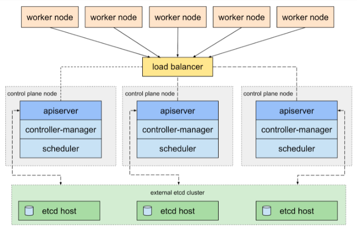
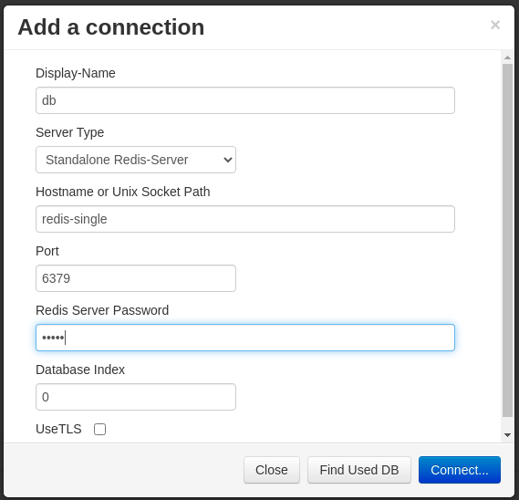

# DESPLIEGUES

La arquitecutra de despligue suele ser una arquitectura de 3 capas, no quiero entrar demasiado en la arquitectura de 3 capas, pero basicamente son 3 capas logicas que representan: 

- una capa de presentacion publica, es accesible desde fuera y es posible enviar informacion afuera
- una capa de logica privada, no es accesible desde fuera pero puede enviar informacion afuera
- una capa de datos, ni es accesible desde fuera ni puede enviar informacion fuera.

A nivel de modelado son un conjunto de subredes publicas, privadas, y de datos.

# Y AHORA QUE?

Ya tenemos nuestra imagen(su nombre PRO: artifact) docker y ahora que? Antes de realizar el despligue se asegura que las imagenes(artifacts) y el codigo(sonarqube, DAST, zap owasp, etc..) esten libres de vulnerabilidades, seguras, chequeos de integridad, etc... Servicios para securizar las imagenes:

- **Harbor.** Conjunto de herramientas que se despliegan en el cluster que securizan las imagens con politicas de acceso, escaneos, y firma de las imagenes, ademas de replicacion, cache del docker hub. https://goharbor.io/
- **Nexus.** Soluciones para auditar y secuirzar las imagenes https://www.sonatype.com/products/repository-oss
- **Jfrog Artifactory.** Si quieres tener un repositorio centralizado de todo, no solo de contenedores. Por contra, soporte malo https://jfrog.com/artifactory/
- **Quay.** Servicio de pago para securizar las imagenes
- **Trivy.** Scanner de vulnerabilidades para imagenes https://github.com/aquasecurity/trivy

> NOTA: Todos los servicios de registros de imagenes tienen sus fallos como caidas, degradaciones, incluso siendo de pago.

Ya hemos dado unas pinceladas, seguimos.

## REGISTRO LOCAL

Kind tiene particularidades que ayudan a cargar imagenes docker en un cluster local para utilizarlo desde kubernetes.


## PLUGIN KUBERNETES PARA VISUAL STUDIO CODE
- Kubernetes para VSCode. 
> https://marketplace.visualstudio.com/items?itemName=ms-kubernetes-tools.vscode-kubernetes-tools


## CREACION CLUSTER

Por defecto se despliega un cluster con un nodo para control plane y nodos para workers. Dentro del control panel esta etcd que es la base de datos. Si no le metemos mucha caña al cluster, es posible quedarse con la configuracion por defecto, PERO si le metemos caña al cluster es mejor separar el apiserver de los etcd, asi puedes escalar los etcd segun necesidad. En esta configuracion podriamos tener: uno o varios nodos para control panel sin etcd, uno o varios nodos solo para etcd, y nodos para workers.




Kind necesita un port mapping con la red exterior a docker en el caso de usar `NodePort` en nuestro caso usamos `ClusterIp`, pero no se si mas adelante lo usaremos `NodePort`, `listenAddress` y `protocol` son opcionales ya que vienen por defecto en `0.0.0.0`

Como en nuestro caso hemos implementado PVCs y PVs, kind necesita 

```
cat << EOF >> kind-config.yaml
apiVersion: kind.x-k8s.io/v1alpha4
kind: Cluster
nodes:
- role: control-plane
- role: worker
  extraMounts:
  - hostPath: ./data-mongodb
    containerPath: /data/db
  - hostPath: ./data-redis
    containerPath: /data
  - hostPath: ./data-api
    containerPath: /usr/src/app
  extraPortMappings:
  # en caso de uso de un nginx
  # api
  - containerPort: 3000
    hostPort: 3001
  - containerPort: 9229
    hostPort: 9229
  # mongo-express
  - containerPort: 8081
    hostPort: 8082
  # mongo
  - containerPort: 27017
    hostPort: 27018
  # redis
  - containerPort: 6379
    hostPort: 6380
  # redis-commander
  - containerPort: 8081
    hostPort: 8083
EOF
```

```
kind create cluster --name testing --config kind-config.yaml
```
Resultado:

```
Creating cluster "testing" ...
 ✓ Ensuring node image (kindest/node:v1.20.2) 🖼 
 ✓ Preparing nodes 📦 📦  
 ✓ Writing configuration 📜 
 ✓ Starting control-plane 🕹️ 
 ✓ Installing CNI 🔌 
 ✓ Installing StorageClass 💾 
 ✓ Joining worker nodes 🚜 
```

Si realizamos un `docker ps` vemos los puertos mapeados:

- 0.0.0.0:9229->9229/tcp
- 0.0.0.0:3001->3000/tcp
- 0.0.0.0:6380->6379/tcp
- 0.0.0.0:8082->8081/tcp
- 0.0.0.0:8083->8081/tcp
- 0.0.0.0:27018->27017/tcp
- 127.0.0.1:34443->6443/tcp


# MANIFIESTOS O ARCHIVOS DE CONFIGURACION

Cada archivo de configuracion de los despligues suele tener miles de lineas, si tienes muchas aplicaciones por desplegar, facilmente llegas a los 20k lineas por un despliegue con chorropecientos archivos. 

Han desarrollado bastantes herramientas para facilitar los despligues, las mas usadas son:
  - **Helm.** package manager, muy estilo a apt, npm,... https://helm.sh/
  - **Jsonnet.** json que permite variables, funciones, no tiene tipos.. asi que seria lo mismo que helm al final
  - **Ytt.** Herramienta que te permite realizar templates con variables, for, if, funciones,... muy estilo sass https://carvel.dev/ytt/
  - **Kustomize.** Herramienta que te permite a partir de templates base, realizar un patch al template base los cambios que quieres para la aplicacion. https://kustomize.io/
  - **Tanka.** Herramienta que permite realizar despliegues modulares sin usar yaml, evolucion de jsonnet y ksonnet. https://github.com/grafana/tanka


## HELM

Es una herramienta que forma parte del ecosistema de kubernetes. Los gurus definen a Helm como un package manager, tambien se utiliza como herramienta de configuracion y te ayuda a ciertos despligues gracias a los templates (similar a ejs, jinja, etc..) y parametrizar las variables en archivos yaml, por ejemplo, variables-base.yaml, variables-produccion.yaml, variables-dev.yaml, y dentro del template se pueden utilizar los tipicos brackets de los templates {{- with .Values.environmentVars }}.

ejemplo:

```
apiVersion: apps/v1
kind: Deployment
metadata:
  name: {{ include "ejemplo.fullname" . }}
    labels:
      {{- include "ejemplo.labels" . | nindent 4 }}
spec:
  selector:
    matchLabels:
      {{- include "ejemplo.selectorLabels" . | nindent 6 }}
  template:
    metadata:
    {{- with .Values.podAnnotations }}
    annotations:
      {{- toYaml . | nindent 8 }}
    {{- end }}
  labels:
    {{- include "ejemplo.selectorLabels" . | nindent 8 }}
  spec:
    containers:
      - name: {{ .Chart.Name }}
        image: "{{ .Values.image.repository }}:{{ .Values.image.tag |
  default .Chart.AppVersion }}"
    {{- with .Values.environmentVars }}
      env:
        {{- toYaml . | nindent 12 }}
    {{- end }}
```


values.yaml

```
#variables
image:
  repository: gitopsbook/ejemplo
  tag: "v0.2"
nameOverride: "ejemplo"
fullnameOverride: "ejemplo"
podAnnotations: {}
environmentVars: [
  {
    name: "DEBUG",
    value: "true"
  }
]
```
```
kubectl create namespace valores && \
helm template . --values values.yaml | kubectl apply -f- --namespace valores
```
Helm tiene la opcion de pasar las variables con `--set clave=valor`, se lo considera un modelo no declarativo, solo consta en la consola, necesario para no tener datos criticos en un repo(aunque hay soluciones para encriptar los secrets), atraves de templates puedes desplegar varias aplicaciones ya que esta parametrizado, etc... 

Ademas desde los templates de helm se pueden realizar cierta logicam,comprobaciones, como comprobar longitud de un nombre de dns
```
# ejemplo-service.dns == ejemplo-service.default.svc.cluster.local
{{ $$dns_name := include "ejemplo-service.dns" . }}
{{ $length := len $$dns_name }}

# Comprobamos si el nombre de la DNS es mayor a 64
{{ if gt $length 64 }}
  {{ $message := printf "%s%s" "DNS excede de 64 caracteres " $$dns_name }}
  {{ fail $message }}
{{ end }}
```


### INSTALACION HELM

https://github.com/helm/helm/releases

Para linux:
```
curl -fsSL -o get_helm.sh https://raw.githubusercontent.com/helm/helm/master/scripts/get-helm-3 && \
chmod 700 get_helm.sh && \
./get_helm.sh && \
rm get_helm.sh
```

Donde obtener charts de helm?:

- **Helm.** comandos:
  > `helm search hub redis`
    - Comando que busca un redis en el hub https://artifacthub.io/ y nos devuelve urls, copiamos/pegamos url, y nos mostrara una web con los comandos necesarios para el despliegue.
  
  > `helm search repo redis`
    - Comando que busca un redis dentro de los repos que hayamos incluido y nos devuelve el nombre_repo/nombre_chart_online.
- **Kubeapps** Dashboard de apps para kubernetes https://kubeapps.com/
- **Bitnami.** Por defecto esta añadido, pero en caso de no tener los charts de bitnami podemos añadirlo con:
    ```
    helm repo add bitnami https://charts.bitnami.com/bitnami
    ```
    url para navegador:
    https://bitnami.com/stacks/helm

- **Github** https://github.com/search?q=chart+helm


## PRIMER REPO AÑADIDO A HELM

```
helm search hub nginx
```

nos devuelve 
```
URL                                               	CHART VERSION	APP VERSION         	DESCRIPTION                                       
https://artifacthub.io/packages/helm/mirantis/n...	0.1.0        	1.16.0              	A NGINX Docker Community based Helm chart for K...
https://artifacthub.io/packages/helm/bitnami/nginx	8.8.3        	1.19.10             	Chart for the nginx server                        
https://artifacthub.io/packages/helm/test-nginx...	0.1.0        	1.16.0              	A Helm chart for Kubernetes                       
https://artifacthub.io/packages/helm/shubhamtat...	0.1.12       	1.19.6              	Nginx Helm chart for Kubernetes                   
```

vamos a la url 
  ```
  https://artifacthub.io/packages/helm/test-nginx/nginx
  ``` 

en la web veremos los comandos necesarios para instalar el redis:

```
helm repo add test-nginx https://vizarg.github.io/helm-chart-nginx/nginx && \
helm install servidorweb test-nginx/nginx --version 0.1.0 -n test --create-namespace
```

Desglose de la instruccion

- **servidorweb** es el nombre de la instalacion/despliegue
- **test-nginx** es el nombre `test-nginx` del repo que le hemos dado antes
- **/nginx** es el nombre del chart
- **--version** es la version que queremos instalar
- **-n test** es el nombre del namespace
- **--create-namespace** en caso de no existir el namespace lo creamos

Nos saldra mensaje y post mensaje **NOTES**:

```
"test-nginx" has been added to your repositories
NAME: servidorweb
NAMESPACE: test
STATUS: deployed
REVISION: 1
NOTES:
1. Get the application URL by running these commands:
  export POD_NAME=$(kubectl get pods --namespace test -l "app.kubernetes.io/name=nginx,app.kubernetes.io/instance=servidorweb" -o jsonpath="{.items[0].metadata.name}")
  export CONTAINER_PORT=$(kubectl get pod --namespace test $POD_NAME -o jsonpath="{.spec.containers[0].ports[0].containerPort}")
  echo "Visit http://127.0.0.1:8080 to use your application"
  kubectl --namespace test port-forward $POD_NAME 8080:$CONTAINER_PORT
```

vemos nuestros repos añadidos con:

```
helm repo list
```

Nos devuelve:

```
NAME       	URL                                  
test-nginx	https://vizarg.github.io/helm-chart-nginx/nginx
```

Ahora vamos a utilizar otra forma para instalar repo. Busqueda e instalacion desde repo:

```
helm search repo nginx
```
```
NAME                            	CHART VERSION	APP VERSION	DESCRIPTION                                       
bitnami/nginx                   	8.8.3        	1.19.10    	Chart for the nginx server                        
bitnami/nginx-ingress-controller	7.6.1        	0.44.0     	Chart for the nginx Ingress controller            
bitnami/kong                    	3.4.8        	2.3.3      	Kong is a scalable, open source API layer (aka ...

```
```
helm install nombre-queremos bitnami/nginx -n test --create-namespace
```

Nos saldra mensaje:

```
NAME: nombre-queremos
NAMESPACE: test
STATUS: deployed
REVISION: 1
TEST SUITE: None
NOTES:
** Please be patient while the chart is being deployed **
NGINX can be accessed through the following DNS name from within your cluster:

    nombre-queremos-nginx.test.svc.cluster.local (port 80)

To access NGINX from outside the cluster, follow the steps below:
[...]
```

- Comando para bajarnos el chart del nginx con `fetch` (helm v2) o `pull` (helm v3):
  ```
  helm fetch test-nginx/nginx --untar
  ```

  ```
  helm pull test-nginx/nginx --untar
  ```

- Para borrar los dos nginx:

  ```
  helm uninstall nombre-queremos -n test && \
  helm uninstall servidorweb -n test
  ```

  Nos enseñara mensaje de borrado:

  ```
  release "nombre-queremos" uninstalled
  release "servidorweb" uninstalled
  ```

  Para comprobar que se han borrado:

  ```
  kubectl get pod -n test
  ```

  ```
  No resources found in test namespace.
  ```


- Para quitar el repo añadido:
  ```
  helm repo remove test-nginx
  ```

- Para borrar el namespace:
  ```
  kubectl delete ns test
  ```


## RECURSOS DISPONIBLES

Vemos algunos recursos que dispone kubernetes para el despliegue:

- **Deployment** Sirve para aplicaciones sin estado, ejemplo: procesar peticiones, interfaces para clientes, etc...

- **StatefulSet** Sirve para aplicaciones con estado proporcionan almacenamiento, ejemplo: base de datos. Tienen un nombre fijo, recursos asignados, nodo asignado

- **ConfigMap** Archivo de configuracion

- **Secret** Contiene credenciales

- **Service** Enruta trafico para `Deployment`

- **Ingress** Contiene reglas de enrutamiento para las peticiones


## DESPLIEGUE CON KUBECTL (NO SEGUIR)

Descargamos el repo con los charts
```
git clone https://github.com/sosan/kube_exp.git
```

Creamos los namespaces para cada despliegue:

```
kubectl create ns dev-mongo && \
kubectl create ns dev-redis && \
kubectl create ns dev-microservicios
```


Despliegue mongo con manifiesto:

```
kubectl apply -f kube_exp/charts/despliegue-mongo/templates/. -n dev-mongo
```

Despliegue redis con manifiesto:

```
kubectl apply -f kube_exp/charts/despliegue-redis/templates/. -n dev-redis
```

Despliegue de los microservicios con manifiesto:

```
kubectl apply -f kube_exp/charts/despliegue-microservicio-1/templates/. -n dev-microservicios && \
kubectl apply -f kube_exp/charts/despliegue-microservicio-2/templates/. -n dev-microservicios && \
kubectl apply -f kube_exp/charts/despliegue-microservicio-3/templates/. -n dev-microservicios
```
```
watch kubectl get pod,svc -n dev-microservicios
```

## DESPLIEGUE CON HELM A KUBERNETES


En la imagen vemos un despliegue mas realista, ahora de momento desplegaremos de helm a kubernetes directo, sin pasar por ci/cd. Los microservicios se suelen pasar por ci/cd, ahora de momento los desplegamos directo a kubernetes.

Helm depende de los repositorios chart. Chart es una coleccion de archivos que describen una serie de recursos para kubernestes, se renderizan en manifiestos. La estructura de un chart tipo es un repo con esta estructura:

```
directorio-charts/
  |-- nombre-paquete-1/
  |   |-- LICENSE
  |   |-- README.md
  |   |-- Chart.yaml
  |   |-- values.yaml
  |   |-- values.schema.json
  |   |-- charts/
  |   `-- templates/
  |       |-- NOTES.txt
  |       |-- deployment.yaml
  |       |-- ingress.yaml
  |       `-- service.yaml
  |
  |-- nombre-paquete-2/
  |   |-- LICENSE
  |   |-- README.md
  |   |-- Chart.yaml
  |   |-- [...]
```

El directorio `templates` contiene los archivos con templates que se combinan con values.yaml y la linea de comandosy, el conjunto se renderiza en manifiestos de Kubernetes.

El archivo `NOTES.txt` muestra instrucciones post-instalacion, por ejemplo, comandos para obtener la ip, etc...

Para crear esta estructura facil, nos ayuda helm con un:

```
helm create dev-mongo
```

Creara los templates para despues rellenar los datos del despliegue del mongo y el mongo-express. Los templates de helm son dificiles de seguir, de momento el codigo de desplgieu lo realizaremos sin templates para que se vea mejor los campos.

> **¿Que es mejor tener un chart con todo el despliegue o cada microservicio tenga su propio chart?**

> **Un chart para todo el despliegue te la comodidad que con un comando lo despliegas todo, pero sientes que tus servicios estan acoplados uno a otro, en cambio un chart para cada microservicio te da la elasticidad de tenerlos independientes.**

> **Normalmente no se suele utilizar ni uno, ni otro, se suele utilizar chart padre (umbrella) y un chart especifico para cada microservicio. Cuando se construya el chart umbrella se auto rellena con los charts de cada microservicio y ademas el chart padre hace de template para los microservicios, los charts hijos sobreescriben la configuracion que necesitan. Cada equipo sobreescribe lo que necesite del chart padre(umbrella). En este capitulo, no seguiremos este metodologia, mas avanzado lo veremos en detalle.**

Borrar el directorio dev-mongo:
```
rm -rf dev-mongo
```


## RECORDATORIO: 
- Para instalar con helm primero debemos incluir el repo chart que queremos usar.
  ```
  helm repo add despliegue https://url_repo_chart.com/
  ```

  En nuestro caso, tenemos dentro de la carpeta `despliegue` el chart del despliegue de redis, mongodb, mongo-express, api.

  En la carpeta `despliegue-mongo` tenemos el despliegue de mongodb y mongo-express. En la carpeta `despliegue-redis` tenemos el despliegue de redis y redis-commander y en la carpeta `despliegue-microservicio-frontend` tenemos el despliegue de los microservicios.

  Ejemplo de un despliegue de redis con helm:

  ```
  helm repo add hephy https://charts.teamhephy.com && \
  helm install redisdb hephy/redis --version v2.4.2 -n test --create-namespace
  ``` 
  y ya tendriamos instalado el redis en el cluster, pero por si hay algun problema con kind, puertos, etc...,prefiero control con un chart.

  borramos el despliegue con:
  ```
  helm uninstall redisdb -n test && \
  helm repo remove hephy
  ```

## Fin Recordatorio

URL de nuestro chart ya creado:

```
https://sosan.github.io/kube_exp/
```

Los charts que estan online estan comprimidos en `.tgz`, helm al realizar un pull/install se conecta a la url y comprueba que haya un index.yaml, que le indica la ruta de los tgz para descargarse.

Github tiene github-action que convierte el chart en tgz, pero nosotros mismos podemos crear el tgz.

### CREACION CHART - OPCIONAL

Nos bajamos el codigo con los charts y entramos dentro de la carpeta `kube_exp` que ha creado el `git clone`

```
git clone https://github.com/sosan/kube_exp.git
```

El comando package de helm permite empaquetar el chart y nos creara los `.tgz`

```
helm package charts/despliegue-mongo && \
helm package charts/despliegue-redis && \
helm package charts/despliegue-microservicios
```

```
Successfully packaged chart and saved it to: despliegue-mongo-0.0.1.tgz
[...]
```
para crear el index lanzamos:

```
helm repo index . --url https://sosan.github.io/kube_exp/
```

> NOTA: `https://sosan.github.io/kube_exp/` seria la url donde estaria disponible el chart

Nos genera un archivo index.yaml similar a:

```
apiVersion: v1
entries:
  despliegue-mongo:
  - apiVersion: v2
    [...]
    name: despliegue-mongo
    type: application
    urls:
    - https://sosan.github.io/kube_exp/despliegue-mongo-0.0.1.tgz
    version: 0.0.1
  despliegue-redis:
  - apiVersion: v2
    [...]
    name: despliegue-redis
    type: application
    urls:
    - https://sosan.github.io/kube_exp/despliegue-redis-0.0.1.tgz
    version: 0.0.1
```

Ahora subimos el index.yaml y los .tgz que nos ha creado a un servidor web y ya hemos creado el chart para consultarlo/descargar online

Todo este proceso de creacion del chart, se puede simplificar con un github-action.


## INSTALACION LOCAL

> NOTA: Podemos utilizar un servicio local para alojar/buscar charts y que te permite subir los charts a cloud. el servicio se llama chartmuseum. De momento no lo vamos a utilizar, pero anotar que existe.
> 
> Link: https://github.com/helm/chartmuseum

> En nuestro caso tenemos un chart online, y queremos traernos el chart a local por motivos que no nos fiamos que vamos a instalar, etc..(inspeccionarlo), creamos un directorio para el chart y dentro del directoio lazamos:

```
helm repo add repo-despliegue https://sosan.github.io/kube_exp/ && \
helm pull repo-despliegue/despliegue-mongo --untar
```
- **repo-despliegue** es el nombre que le damos al repo del chart
- **pull** nos trae el `tgz` y los descoprimimos con `--untar`
- **repo-despliegue** es el nombre del repo que le hemos dado: `repo-despliegue`
- **despliegue-mongo** es el nombre del chart

> lo tenemos descomprimido y ahora podemos inspeccionar/modificar el chart y seguir con la instalacion local

```
helm install mongo ./kube_exp/despliegue-mongo/ -n dev-mongo --create-namespace && \
helm install redis ./kube_exp/despliegue-redis/ -n dev-redis --create-namespace && \
helm install microservicios ./kube_exp/despliegue-microservicios/ -n dev-microservicios --create-namespace
```

- **mongo** es el nombre local que le damos al chart.
- ./kube_exp/despliegue-mongo/ es la carpeta del chart
- `--create-namespace` nos crea el namespace si no existe

## INSTALACION ONLINE

Confiamos en el repo destino y tiramos install sin pensarnoslo

```
helm repo add repo-despliegue https://sosan.github.io/kube_exp/ && \
helm install mongo repo-despliegue/despliegue-mongo -n dev-mongo --create-namespace && \
helm install redis repo-despliegue/despliegue-redis -n dev-redis --create-namespace && \
helm install microservicios repo-despliegue/despliegue-microservicios -n dev-microservicios --create-namespace && \
```
- **mongo** es el nombre local que le damos al chart.
- **repo-despliegue/despliegue-mongo** es el nombre del repo: `repo-despliegue` / `despliegue-mongo` es el nombre del chart que tiene online


vemos como va desplegando mongo (control + c para salir):
```
watch kubectl get svc,pod -n dev-mongo
```
> Cambiar. tambien vemos como el `pod/api-*` no consigue hacer un pull a la imagen de la api, no reconoce la imagen.

es posible que `pod/mongo-express-*` se caiga un par de veces por la conexion con mongodb, en 1min se vuelve estable la conexion entre mongo-express y mongodb. No realizamos healthcheck, a piñon!

Comprobamos los logs del servicio `mongo-expres-service` con:
```
kubectl logs service/mongo-express-service -n dev-mongo
```

Y Nos mostrara algo similar a:

```
Waiting for mongodb-single:27017...
Welcome to mongo-express
------------------------


Mongo Express server listening at http://0.0.0.0:8081
Server is open to allow connections from anyone (0.0.0.0)
basicAuth credentials are "admin:pass", it is recommended you change this in your config.js!
Database connected
Admin Database connected
```

> NOTA: existe aplicaciones como `wait` donde podemos inyectar un wait a otros contenedores que arranquen o bien usar livenessprobe. https://github.com/ufoscout/docker-compose-wait 
>
>     livenessProbe:
>       enabled: true
>       initialDelaySeconds: 30
>       periodSeconds: 10
>       timeoutSeconds: 5
>       failureThreshold: 6
>       successThreshold: 1
>     readinessProbe:
>       enabled: true
>       initialDelaySeconds: 5
>       periodSeconds: 10
>       timeoutSeconds: 5
>       failureThreshold: 6
>       successThreshold: 1


> TODO: ampliar informacion healthcheck. en k8s es aconsejable que todas las apps tengan una url especifica para comprobar healthcheck

Si queremos entrar dentro de la base de datos con la instruccion:

```
kubectl exec -it svc/mongodb-single -n dev-mongo -- bash
```

> NOTA: aunque el despliegue lo tengamos en diferentes namespaces `dev-mongo`, `dev-redis` desde otros namespaces pueden acceder a otross namespaces, en el caso de que queramos restringir accesos a otros namespaces, necesitariamos politicas de seguridad.


si queremos borrar el despliegue:

```
helm uninstall mongo -n dev-mongo && \
helm uninstall redis -n dev-redis && \
helm uninstall microservicios -n dev-microservicios
```


> **TODO:** ampliar informacion de como inyectar imagen a kind con `kind load docker_imagen mi-app:v1`

Ahora vamos a realizar de forma muy cutre y rapida un port-forward para saber si funciona correctamente el despliegue. Con el `&` al final significa que desacoplamos el port-forward de la consola. Abrimos consola para el port-forward y lanzamos:
```
kubectl port-forward service/redis-commander 8083 -n dev-redis &
```
```
kubectl port-forward service/mongo-express-service 8082 -n dev-mongo &
```

Abrimos navegador y lanzamos contra redis-commander y mongo-express:
- localhost:8083
- localhost:8082

Si el servidor redis tiene contraseña, redis-commander no engancha el servidor redis. Toca añadirlo manualmente.
La contraseña es `admin` esta en el archivo `charts/despliegue-redis/templates/redis-deployment.yaml`.
> TODO: mejorar

> Con `StatefulSet`

De esta forma no es necesario inscribir una IP, con el nombre del servicio `redis-single` puerto (6379), contraseña `admin`, pa dentro!



> Despliegue del servidor redis de forma con `Deployment`

Obtener la ip del servidor redis:

```
kubectl get svc redis -n dev-redis -o jsonpath="{.spec.clusterIP}:{.spec.ports[0].port}" && \
echo
```


comando para borrar el chart redis:

```
helm uninstall mongo -n dev-mongo && \
helm uninstall redis -n dev-redis && \
helm uninstall microservicios -n dev-microservicios
```


al cabo de un rato se borrara el despliegue

## KUBERNETES VOLUMENES

El sistema de archivos de los contenedores docker esta activo hasta que el contenedor termina, se reinicia, etc... Un volumen en kubernetes tiene la misma existencia que el contenedor. Los datos de un volumen en docker persistente aunque el contenedor se haya caido. En el caso de kubernetes, los datos no persisten.

Un pod comparte el sistema de archivos entre los contenedores que esten dentro, si existen varios contenedores dentro de un pod, se tienen que montar diferentes puntos de montaje, sino un contenedor machara los datos del otro contenedor. Para que los datos sean consistentes es necesario que el almacenamiento sea independiente del pod.

Para aprovisionar almacenamiento, es bastante recomendable utilizar `PersistentVolumeClaim`(PVC) para manejar las apliaciones stateful. Con PVC un pod puede requerir y conectar volumenes que existen independientemente de la vida del pod. 

Las PVC ofrecen la ventaja de serpara a los Ops de los devs, sysadmin aprovisiona volumenes, y los desarrolladores piden recursos de volumen sin saber exactamente el proveedor.

- PVC se montan dinamicamente cuando los pods lo necesitan y se consume en forma de volumen
- PV son volumenes aprovisionados manualente por el sysadmin
- Storage classes permiten aprovisionar dinamicamente volumenes y PV, aunque por defecto estan predefinidas por el sysadmin.

Los sistemas de almacenamiento distribuido permite solucionar los problemas que ocurren en las apliaciones statefull con alta disponibilidad.

El sysadmin aprovisiona almacenamiento en red en las nubes publicas, solicitando VSANS, EBS, ROOK(ceph)...

El despliegue de redis y mongo utiliza pvc, pv, secretos. en definitiva, un despliegue mas cerca de un caso real sin tener en cuenta politicas de red, seguridad, etc....

Redis-Commander y Mongo-express tienen el despliegue en forma de `Deployment` porque no es necesiario tener un estado, en cambio, las bases de datos si que tienen un estado a conservar.


## SECRETOS

Herramienta para tener los secretos encriptados en el manifiesto

https://github.com/bitnami-labs/sealed-secrets

chart ejemplo:
```
apiVersion: bitnami.com/v1alpha1
kind: SealedSecretController
metadata:
  name: SealedSecretController
spec:
  image:
    repository: >-
      quay.io/bitnami/sealed-secrets-controller@sha256:8e9a37bb2e1a6f3a8bee949e3af0e9dab0d7dca618f1a63048dc541b5d554985
    pullPolicy: IfNotPresent
  resources: {}
  nodeSelector: {}
  tolerations: []
  affinity: {}
  controller:
    create: true
  serviceAccount:
    create: true
    name: ''
  rbac:
    create: true
    pspEnabled: false
  secretName: sealed-secrets-key
  ingress:
    enabled: false
    annotations: {}
    path: /v1/cert.pem
    hosts:
      - chart-example.local
    tls: []
  crd:
    create: true
    keep: true
  networkPolicy: false
  securityContext:
    runAsUser: 1001
    fsGroup: 65534
  podAnnotations: {}
  podLabels: {}
  priorityClassName: ''
```


> TODO: comentar despliegue de mongodb y redis