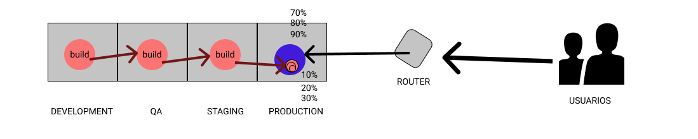

# QUE SON LOS MICROSERVICIOS?

Bla bla tecnico....

Los microservicios que son? api? soa? lambda? Es dificil definir que son los microservicios, las barreras se difuminan.

Cuando hablamos de microservicios no estamos hablando necesariamente de apis, pero es la mejor forma de realizar microservicios.

- Microservicios seria la arquitectura de software
- API seria la tecnologia.
- Service mesh y api gateway serian la arquitectura de infra.
    - A grandes rasgos las diferencias entre los dos es que api gateway te hacen de puerta de entrada y publican servicios, y service mesh te realiza la conexion por dentro.

A nivel tecnico, tanto service mesh como gateway suelen usar internamente proxy envoy, tipo de proxy parecido nginx.

# API GATEWAY

Una api gateway basicamente es un proxy con ingress(trafico entrante) y un egress(trafico saliente) para todo el trafico que recibe el backend, ya puede ser una app, web, servicios de terceros o propios.

el gateway recibe las requests entrantes y las direcciona a la parte del sistema que se ocupa del trabajo y devuelve el resultado al cliente, a parte de realizar el trabajo de proxy, provee seguridad, load balancer, monitoreo, traceo.

### HERRAMIENTAS DE API GATEWAY:

- ambassador: (rey indiscutible de los api gateway) https://www.getambassador.io/products/edge-stack/api-gateway/
- kong https://konghq.com/


# SERVICE MESH

Implantacion de los service mesh de 2020


Imagen sacada de:
https://www.cncf.io/wp-content/uploads/2020/08/CNCF_Survey_Report.pdf

el significado de `service mesh` designa a la red de los microservicios que interactuan entre ellos.
este tipo de servicios, a parte de los servicios innerentes como deteccion, load balancing, metricas, monitoreo, ofrecen despliegues a/b, canary, control de acceso, autentificacion.

service mesh rellena el hueco no cubre el api gateway, por ejemplo, que el uptime del serivicio sea critico, control ferreo sobre lo que ocurre dentro de los microservicios, te facilita el serverless, pero no todo el mundo necesita un `service mesh` por coste, trabajo, overhead a la aplicacion, etc...

> NOTA: creo que el service mesh se va convertir en standard porque los api gateway, ya integran sus propios services mesh o de terceros.


Imagen de la arquitectura de service mesh

### HERRAMIENTAS PARA REALIZAR EL SERVICE MESH


> **istio**: kubernetes pa ricos. Istio añade en cada pod un congromelerado de proxys, y sniffer, que recogen/redirigen/enrutan el trafico hacia el contenedor. La configuracion es dificil, añade necesidad de mas ram, mas latencia, pero lo tiene todo de base.

> **linkerd**: kubernetes pa pobres. Linkerd es un proxy que hace el efecto mesh, 0 complicaciones, mucho mas ligero que istio pero le faltan muchas cosas que ha istio ya las tiene de base. Soporta los mismos protocolos que istio.

> **consul**: es un servidor para configuracion distribuida. es la solucion mas madura, y ademas ofrece soporte para empresas.

> NOTA: ** El uso de cada uno depende de para que lo quieres usar. Ejemplo: Tienes muchos equipos desarrollando muchos servicios. Muchos lenguajes de programacion, muchas librerias. pongo service mesh que controle el authN y el authZ. ¿Consentimos tener overhead de consumo, o lo delegamos a los equipos de desarrollo?**

Mas info en: https://servicemesh.es/

# Imagen despligue a/b


# Imagen despligue canary



# KUBERNETES

kubernetes nos ayuda en elasticidad necearia para los microservicios, ademas cambia el paradigma de despligue: ¿conexiones a una maquina via ssh? 0 o las menos posibles, con las herramientas nos permite realizar un despliegue usando el chat de slack o mattermost

hay muchas soluciones para tener kubernetes en local: k3s, minikube, kind, microk8s, k0s,.... pero pocas tienen soporte actual con terraform.

- kind => require 8gigas de ram, terraform le da soporte, otras soluciones exponen los puertos por defecto
- minikube => require 2gb de ram
- k3s => require 500MB de ram
- microk8s => require 200MB de ram
- k0s => no lo he probado


*Imagen arquitectura kubernetes*


# KIND

## Instalacion kind

```
curl -Lo ./kind https://kind.sigs.k8s.io/dl/v0.10.0/kind-linux-amd64 && \
chmod +x ./kind && \
sudo mv ./kind /usr/local/bin/kind
```

## Creacion de un cluster

Un cluster creado con kind tiene la particularidad que necesita un portmapping para que sea accedido desde el exterior de la red docker. El portmapping se puede realizar en la configuracion del cluster(puerto_contenedor a puerto_serivicio), usando un proxy ingress que enrute el trafico hacia los puertos, (los datos en vez de tenerlos configuracion del cluster lo tiene el proxy -mas actualizable-), port forward con kubectl (el mas cutre, pero funca).

```
kind create cluster --name testing
```


# ---- NOTA: no necesiario seguir ------- 

Instalacion balanceador de carga
```
sudo apt install jq
```

uso del script 

nano nombre_script.sh

copiamos y pegamos este codigo dentro del archivo:

```
#!/bin/bash

# Creacion cluster

nombre_cluster=$1
echo $nombrecluster

kind create cluster --name $nombre_cluster

# Obtenemos configuracion
kind get kubeconfig --name $nombre_cluster > /tmp/$nombre_cluster-kubeconfig

# Deploy de metallb
KUBECONFIG=/tmp/$nombre_cluster-kubeconfig kubectl apply -f https://raw.githubusercontent.com/metallb/metallb/v0.9.6/manifests/namespace.yaml
KUBECONFIG=/tmp/$nombre_cluster-kubeconfig kubectl apply -f https://raw.githubusercontent.com/metallb/metallb/v0.9.6/manifests/metallb.yaml
KUBECONFIG=/tmp/$nombre_cluster-kubeconfig kubectl create secret generic -n metallb-system memberlist --from-literal=secretkey="$(openssl rand -base64 128)"

# Obteniendo informacion de la interfaz de la red docker
network=$(docker inspect $nombre_cluster-control-plane | jq -r .[0].HostConfig.NetworkMode)

echo "## Docker network: $network"
subnet=$(docker network inspect $network | jq -r .[0].IPAM.Config[0].Subnet)

echo "## Subnet: $subnet"
gw=$(docker network inspect $network | jq -r .[0].IPAM.Config[0].Gateway)

echo "## Gateway: $gw"
read A B C D <<<"${gw//./ }"

# Aplicacmos configuracion segun la infomacion obtenida de docker
cat << EOF > /tmp/metallb-config.yaml
apiVersion: v1
kind: ConfigMap
metadata:
  namespace: metallb-system
  name: config
data:
  config: |
    address-pools:
    - name: default
      protocol: layer2
      addresses:
      - $A.$B.255.1-$A.$B.255.200
EOF
KUBECONFIG=/tmp/$nombre_cluster-kubeconfig kubectl apply -f /tmp/metallb-config.yaml
# Listo!
```

cambiamos permisos a ejecucion
```
chmod +x nombre_script.sh
```

```
./nombre_script.sh nombre_cluster_deseado
```

sale:

```
Creating cluster "testing" ...
 ✓ Ensuring node image (kindest/node:v1.20.2) 🖼
 ✓ Preparing nodes 📦
 ✓ Writing configuration 📜
 ✓ Starting control-plane 🕹️
 ✓ Installing CNI 🔌
 ✓ Installing StorageClass 💾
 [...]
```
# ---- FIN NOTA: no necesiario seguir ------- 


# KUBECTL

kubectl es una cliente de kubernetes para linea de comandos, nos sirve para la interactuamos con kubernetes, muy al estilo docker, podman.

## Instalacion

```
curl -LO "https://dl.k8s.io/release/$(curl -L -s https://dl.k8s.io/release/stable.txt)/bin/linux/amd64/kubectl" && \
chmod +x ./kubectl && \
sudo mv ./kubectl /usr/local/bin/kubectl
```


## USO

kubectl no tiene autocompletado, existen herramientas de tercero que incluye funcionalidades de autocompletado por ejemplo: kube-prompt. 

Demo: 


link de kube-prompt: https://github.com/c-bata/kube-prompt

Instalacion Linux(primero debemos tenemos que tener instalado kubectl) (para salir `control + D` o escribir `exit`):
```
sudo apt install unzip && \
wget https://github.com/c-bata/kube-prompt/releases/download/v1.0.11/kube-prompt_v1.0.11_linux_amd64.zip && \
unzip kube-prompt_v1.0.11_linux_amd64.zip && \
chmod +x kube-prompt && \
sudo mv ./kube-prompt /usr/local/bin/kube-prompt
```

tambien podemos añadir alias a los parametros de kubectl, ejemplo, repo con muchos alias, https://github.com/ahmetb/kubectl-aliases

# PANEL DE CONTROL

para ver el panel de control

solo para ver los pods de sistema. --namespace seria similar a directorios/carpetas, asi tienes mejor organizado el cluster

```
kubectl get all --namespace kube-system
```

da resultado:
```
NAME                                                READY   STATUS    RESTARTS   AGE
pod/coredns-74ff55c5b-67w4n                         1/1     Running   0          16s
pod/coredns-74ff55c5b-bzhmw                         1/1     Running   0          16s
pod/etcd-testing-control-plane                      1/1     Running   0          16s
pod/kindnet-dldwq                                   1/1     Running   0          16s
pod/kube-apiserver-testing-control-plane            1/1     Running   0          16s
pod/kube-controller-manager-testing-control-plane   1/1     Running   0          16s
pod/kube-proxy-nv9vg                                1/1     Running   0          16s
pod/kube-scheduler-testing-control-plane            1/1     Running   0          16s

NAME               TYPE        CLUSTER-IP   EXTERNAL-IP   PORT(S)                  AGE
service/kube-dns   ClusterIP   10.96.0.10   <none>        53/UDP,53/TCP,9153/TCP   16s

NAME                        DESIRED   CURRENT   READY   UP-TO-DATE   AVAILABLE   NODE SELECTOR            AGE
daemonset.apps/kindnet      1         1         1       1            1           <none>                   16s
daemonset.apps/kube-proxy   1         1         1       1            1           kubernetes.io/os=linux   16s

NAME                      READY   UP-TO-DATE   AVAILABLE   AGE
deployment.apps/coredns   2/2     2            2           16s

NAME                                DESIRED   CURRENT   READY   AGE
replicaset.apps/coredns-74ff55c5b   2         2         2       16s
```

distinguimos:

- etcd => pod/etcd-testing-control-plane
- api-server => pod/kube-apiserver-testing-control-plane
- control manager => pod/kube-controller-manager-testing-control-plane
- proxy => pod/kube-proxy-kdszr
- scheduler => pod/kube-scheduler-testing-control-plane
- dns =>  pod/coredns-74ff55c5b-bgllf, pod/coredns-74ff55c5b-lqz2n


# DASHBOARD (mini tuto del dashboard)

el dashboard por defecto de kubernetes es el mas maduro, pero tiene algunas pegas bastante grandes:

- las opciones de filtrado estan bastante limitadas
- manejo de accesos, privilegios
- por defecto, login o por subir el kubeconfig (archivo donde va guardando el estado/configuracion de los clusters) o por token cada vez que quieras loguear(el token tiene una vida de unos 15 minutos). Vemos el dashboard mas adelante. La forma idonea seria un proxy enfrente con un servicio como keycloak que te gestiona oauth2, openid, etc... para simplificar el login.
- tiene que ser instalado dentro del cluster, significa que el dashboard integra un grafana + influxdb, osea crea un pod para el dashboard, un pod para grafana, pod para influxdb, con el consecuente consumo de recursos.


Otros dashboards( no los he probado todos, se suelen instalar fuera del cluster y leen la configuracion del cluster desde kubeconfig):
- octant: https://octant.dev/
- kubenav: https://kubenav.io/ (util para cosas rapidas)
- lens: https://github.com/lensapp/lens
- kubernetic: https://www.kubernetic.com/ (pago)


otras herramientas que se utilizan para administrar el kubernetes son kops, kubeadm para realizar el mantenmiento, monitoreo: grafana + prometheus, grafana loki (ligero porque en logs inyecta un tag, asi no necesitas un elasticsearch), opentracing + jaeger para trazas del usuario dentro de la aplicacion (servicios de pago: newrelic, xray de aws(https://aws.amazon.com/es/xray/), etc... )...


link a kops: https://kops.sigs.k8s.io/

el dashboard por defecto se inicia como acceso tipo `clusterip` (pod que no tiene acceso a otros pods). el dashboard no esta expuesto al exterior del cluster (cuando esta expuesto y se le puede acceder se llama servicio). Para poder acceder al dashboard tendremos que cambiar el tipo de acceso al pod o bien `nodeport`, o a `loadbalancer`(ideal para alta disponibilidad).

## Instalacion Dashboard por defecto

### - Con helm
helm es un package manager para kubernetes, similar a npm con añadidos de git, creacion/modificacion de templates, etc...
simplifica bastante la tarea de instalacion/actualizacion herramientas. 

Pequeña pincelada:

añadimos el repo al 
```
helm repo add kubernetes-dashboard https://kubernetes.github.io/dashboard/
```

instalacion:
```
helm install kubernetes-dashboard/kubernetes-dashboard --name dashboard_defecto
```

desintalacion:

```
helm delete dashboard_defecto
```

instalacion del dashboard con nombre, ip, limite de cpu asignados. de esta forma se pueden cambiar valores como si fuera un key=value `--set key=value[,key=value]`:
```
helm install kubernetes-dashboard/kubernetes-dashboard --name kubernetes-dashboard \
  --set=service.externalPort=8080,resources.limits.cpu=200m
```


<!-- otra forma para cambiar configuracion:

```
helm install kubernetes-dashboard/kubernetes-dashboard --name kubernetes-dashboard -f archivo_con_valores_cambiado.yaml
``` -->

### - Con kubectl

realizamos el despliegue con este comando, aplicamos la configuracion (archvio yaml) sobre kubernetes, por defecto, instalara en el namespace kubernetes-dashboard

```
kubectl apply -f https://raw.githubusercontent.com/kubernetes/dashboard/v2.2.0/aio/deploy/recommended.yam
```

para ver el despligue de pods y servicios:

```
kubectl get pod,svc -n kubernetes-dashboard
```
resultado:

```
NAME                                             READY   STATUS    RESTARTS   AGE
pod/dashboard-metrics-scraper-79c5968bdc-9pm8x   1/1     Running   0          25s
pod/kubernetes-dashboard-9f9799597-4kfgp         1/1     Running   0          25s

NAME                                TYPE        CLUSTER-IP     EXTERNAL-IP   PORT(S)    AGE
service/dashboard-metrics-scraper   ClusterIP   10.96.211.111  <none>        8000/TCP   25s
service/kubernetes-dashboard        ClusterIP   10.96.80.8     <none>        443/TCP    25s
```


## Login via Nodeport / Loadbalancer

ahora que tenemos instalado el dashboard, si nos hemos olvidado de algun parametro de la configuracion o queremos cambiar la configuracion podemos editar  podemos editar manualmente la configuracion del pod `kubernetes-dashboard`.

### Edicion Con vi

lanzamos manualmente el editor vi con:

```
kubectl edit services kubernetes-dashboard -n kubernetes-dashboard
```
> -n significa namespace(--namespace). un namespace seria similar a una carpeta/directorio, asi tienes mejor organizado el cluster

pulsamos i y sustituimos el texto `ClusterIP` por `NodePort`  y guardamos el fichero ESC + :wq

### Edicion yaml

si le añadimos `-o yaml` al comando anterior, mostrara la configuracion del pod en formato yaml y podemos modificar la informacion que hay dentro del yaml. simplemente cambiamos el yaml con un editor o con un sed.

ejemplo: si escribimos

```
kubectl get services kubernetes-dashboard -n kubernetes-dashboard
```

nos devuelve en este formato:
```
NAME                   TYPE        CLUSTER-IP   EXTERNAL-IP   PORT(S)   AGE
kubernetes-dashboard   ClusterIP   10.96.80.8   <none>        443/TCP   4m
```
y si escribimos:

```
kubectl get services kubernetes-dashboard -n kubernetes-dashboard -o yaml
``` 

nos devolvera la configuracion en fomato yaml:

```
apiVersion: v1
kind: Service
metadata:
  annotations:
    kubectl.kubernetes.io/last-applied-configuration: |
[...]
```

redirigimos la informacion a un archivo con:

```
kubectl get services kubernetes-dashboard -n kubernetes-dashboard -o yaml > dashboard.yaml
```

ahora podemos modificar el archivo `dashboard.yaml` bien con el editor vi, nano,... o bien con un sed. 
en este caso cambiamos de `ClusterIP` a `NodePort` con sed.
no le añadimos un puerto, el sistema eligira el puerto(mas adelante mostramos el puerto).

```
sed -i s#ClusterIP#NodePort#g dashboard.yaml
```

y aplicamos los cambios:


```
kubectl apply -f dashboard.yaml
```

nos saldra un mensaje parecido:

```
service/kubernetes-dashboard configured
```

comprobamos que se ha realizado el cambio y no este pendiente con:

```
kubectl get service kubernetes-dashboard -n kubernetes-dashboard
```
```
NAME                   TYPE       CLUSTER-IP   EXTERNAL-IP   PORT(S)         AGE
kubernetes-dashboard   NodePort   10.96.80.8   <none>        443:32552/TCP   6m
```
En PORTS tenemos los puertos 443 y 32552(puerto expuesto) que estan abiertos.
443 puerto local del pod
325552 puerto expuesto del servicio. el numero va entre 30000 y 32767:


Podemos hacer que la ip se muestre mas elegante con:

```
kubectl get service kubernetes-dashboard -n kubernetes-dashboard -o jsonpath="{.spec.ports[0].nodePort}" && echo " es el puerto"
```
```
32552 es el puerto
```
con `-o jsonpath` podemos hacer autenticas virguerias.


- En el caso de kind, ya que el cluster esta dentro de la red docker, necesitamos un proxy entre el exterior de docker y el cluster de kubernetes. Desde otra solucion (microk8s, etc..) podriamos añadir un balanceador de carga, proxy... para que saliera fuera.

```
kubectl proxy --address 0.0.0.0 --accept-hosts '.*'
```

ahora nos queda ir al navegador y poner en la url del navegador:

```
http://IP_DE_LA_MAQUINA:8001/api/v1/namespaces/kubernetes-dashboard/services/https:kubernetes-dashboard:/proxy/#/login
```


- Con patch(peligroso)

Con patch modificamos al vuelo el tipo, ahora lo hemos cambiado a loadbalancer. la informacion actua como si fuera un json

```
kubectl patch service kubernetes-dashboard -n kubernetes-dashboard -p '{"spec": {"type": "LoadBalancer"}}'
```
comprobamos los cambios

```
kubectl get service kubernetes-dashboard -n kubernetes-dashboard
```

saldra algo parecido a esto. fijarse que la ip externa estara todo el tiempo pendiente, porque el servicio `LoadBalancer` por defecto solo esta disponible en AWS, Azure, GCP,..., para obtener la funcionalidad de `LoadBalancer` hay que instalar servicio de balanceador de carga tipo MetalLB https://metallb.universe.tf/ (al principio pequeño tuto)

```
NAME                   TYPE           CLUSTER-IP      EXTERNAL-IP   PORT(S)         AGE
kubernetes-dashboard   LoadBalancer   10.96.80.8      <pending>     443:32454/TCP   10m
```
podemos cambiarlo de nuevo a nodePort con:

```
kubectl patch service kubernetes-dashboard -n kubernetes-dashboard -p '{"spec": {"type": "NodePort"}}'
```


## Login dashboard

Abrimos nueva consola o cortamos el proxy con CONTROL + c

Y nos aparece asi:


Por defecto esta seleccionado la opcion token.

Ahora para entrar al dashboard creamos un nuevo usuario con `ServiceAccount`, le damos permisos de administrador <ÑAPA, ÑAPA> y nos logueamos usando un bearer token. Por defecto, suelen durar 15 minutos.

> **NOTA:** este metodo es una ñapa de cuidao


```
cat <<EOF | kubectl apply -f -
apiVersion: v1
kind: ServiceAccount
metadata:
  name: admin-dashboard
  namespace: kubernetes-dashboard
---
apiVersion: rbac.authorization.k8s.io/v1
kind: ClusterRoleBinding
metadata:
  name: admin-dashboard
roleRef:
  apiGroup: rbac.authorization.k8s.io
  kind: ClusterRole
  name: cluster-admin
subjects:
- kind: ServiceAccount
  name: admin-dashboard
  namespace: kubernetes-dashboard
EOF
```
vemos resultado:

```
serviceaccount/admin-dashboard created
clusterrolebinding.rbac.authorization.k8s.io/admin-dashboard created
```

ahora debemos encontrar el token para el usuario `admin-dashboard` para asi realizar el login

```
token=$(kubectl get serviceaccount admin-dashboard -n kubernetes-dashboard -o jsonpath="{.secrets[0].name}")
```

devolvera algo similar al contenido de abajo. kubernetes al final de cada nombre rellena con caractereres aleatorios:

```
admin-dashboard-token-q6d6d
```

ahora tenemos el token y ahora obtenemos el secret para poder loguearnos en el dashboard

```
token_login=$(kubectl get secret $token -n kubernetes-dashboard -o jsonpath="{.data.token }") && \
echo $token_login | base64 --decode && \
echo
```

devolvera el secreto descodificado, hay que copiar el secreto descodificado y pegarlo en en el login del dashboard
RECUERDO: tokens para el dashboard solo duran unos 15 minutos, cuando termine el tiempo hay que volver a crear el usuario, obtener token, secreto....


para borrar cuenta y privilegios del usuario `admin-dashboard`

```
sudo kubectl delete serviceaccount admin-dashboard -n kubernetes-dashboard  && \
sudo kubectl delete clusterrolebinding admin-dashboard -n kubernetes-dashboard 
```

TODO: persistencia en el dashboard


fin mini tuto
